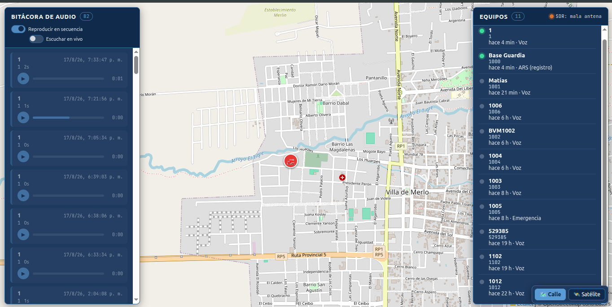

# tracking-GPS-VHF

Sistema de monitoreo en tiempo real para la flota de radios DMR del Cuartel de
Bomberos Voluntarios de Merlo (San Luis, Argentina).

## Descripción

El sistema captura por RF la señal DMR de la repetidora del cuartel con un SDR, la
decodifica de forma independiente (sin depender de licencias comerciales de
Motorola ni del software de despacho que traía el sistema originalmente), y expone
en tiempo real qué equipos están activos, con qué transmitieron, y una bitácora de
audio reproducible de cada transmisión.

**Estado del GPS de posición:** el objetivo original del proyecto era reemplazar
también la localización GPS que ofrecía TRBOnet. A la fecha, tras numerosas
sesiones de investigación documentadas en
[`sdr-decoder/INVESTIGACION_LRRP.md`](./sdr-decoder/INVESTIGACION_LRRP.md), **no
se logró capturar un reporte de posición (LRRP) real** de ningún equipo. La
evidencia acumulada apunta a que el protocolo de posición requiere una solicitud
activa desde una aplicación de red autenticada contra la repetidora — camino
bloqueado hoy por la autenticación TLS-PSK del equipo. El mapa interactivo existe
en el frontend y está listo para mostrar posiciones en cuanto ese bloqueo se
resuelva, pero hoy no recibe datos reales.

## Funcionalidades implementadas

- **Presencia de equipos en tiempo real**: qué radio transmitió, cuándo, y qué
  tipo de evento (voz, emergencia, registro automático ARS).
- **Bitácora de audio**: cada transmisión de voz queda grabada y disponible para
  reproducir desde el panel, con reproducción exclusiva, modo secuencial y modo
  "escuchar en vivo".
- **Estado del SDR en tiempo real**: indicador visual de si el hardware de
  captura está conectado, recibiendo datos, con problemas de antena, u operando
  con normalidad.
- **Catálogo de equipos identificados**: ver
  [`sdr-decoder/equipos.md`](./sdr-decoder/equipos.md) para el detalle de cada
  radio_id conocido, marca/modelo, y hallazgos particulares.

## Capturas de pantalla

**Panel de equipos en tiempo real**


**Bitácora de audio**


**Vista general del frontend**



## Componentes

El proyecto está dividido en cuatro servicios, orquestados con Docker Compose:

| Servicio | Función |
|---|---|
| `sdr-decoder` | Captura la señal DMR vía SDR, decodifica presencia/voz/audio (y, a futuro, LRRP), y envía todo al backend. Corre 100% en contenedor, sin pasos manuales. |
| `backend` | Expone la API que recibe los eventos, los persiste, y sirve los datos al frontend en tiempo real vía WebSocket. |
| `database` | PostgreSQL, persistencia de equipos, eventos y audio. |
| `frontend` | Interfaz web con mapa, panel de equipos, bitácora de audio y estado del SDR. |

El detalle técnico completo, las decisiones de diseño, y el esquema de datos están
documentados en [`docs/ARQUITECTURA.md`](./docs/ARQUITECTURA.md).

## Documentación relacionada

- [`docs/ARQUITECTURA.md`](./docs/ARQUITECTURA.md) — arquitectura completa del
  sistema.
- [`docs/API.md`](./docs/API.md) — contrato de todos los endpoints.
- [`docs/operacion-sdr.md`](./docs/operacion-sdr.md) — qué significa cada estado
  del SDR y cómo actuar ante cada uno, incluyendo el procedimiento manual de
  recalibración.
- [`sdr-decoder/INVESTIGACION_LRRP.md`](./sdr-decoder/INVESTIGACION_LRRP.md) —
  historial completo de la investigación técnica del protocolo, sesión por
  sesión.
- [`sdr-decoder/equipos.md`](./sdr-decoder/equipos.md) — catálogo de equipos de
  radio identificados.

## Cómo levantar el sistema

**Importante: este proyecto está pensado exclusivamente para Ubuntu, corriendo
100% en Docker. No está soportado en Windows.** El servicio `sdr-decoder`
necesita acceso directo al bus USB del host para hablar con el dongle SDR — algo
que en Windows requeriría herramientas adicionales frágiles (passthrough USB vía
`usbipd-win`) que quedaron descartadas a propósito para mantener el sistema
simple y confiable. Todo el desarrollo, las pruebas, y el uso real ocurren en
Ubuntu.

### Requisitos previos (una sola vez, en el host)

1. **Docker y Docker Compose** instalados.
2. **Dongle RTL-SDR conectado** al host.
3. **Blacklist del driver de TV del kernel**, que reclama el dongle por
   defecto:
   ```bash
   echo "blacklist dvb_usb_rtl28xxu" | sudo tee /etc/modprobe.d/blacklist-rtlsdr.conf
   ```
4. **Regla udev con identificador estable**, para que el dongle siempre
   aparezca en el mismo path (`/dev/sdr_bomberos`) sin importar el puerto USB o
   el orden de conexión — necesario para que el `docker-compose.yml` pueda
   mapearlo de forma confiable al contenedor `sdr-decoder`. Ya está
   documentada y creada en `/etc/udev/rules.d/99-rtlsdr-tracking.rules`.
5. Verificar que todo lo anterior esté en orden corriendo:
   ```bash
   ./sdr-decoder/check_sdr.sh
   ```

### Levantar el sistema

```bash
cp .env.example .env
# completar POSTGRES_PASSWORD y revisar el resto de las variables

docker compose up --build
```

Con eso arrancan los 4 contenedores, incluyendo la captura y decodificación real
por SDR — **sin necesidad de correr ningún script aparte**. El sistema queda
escuchando de forma continua y desatendida.

- Frontend: `http://localhost:8080`
- Backend / health check: `http://localhost:8000/health`

### Sobre la calibración del SDR

El offset de frecuencia del dongle deriva con el tiempo (por temperatura y otros
factores) y hoy **no se recalibra solo**. El sistema clasifica y muestra su
propio estado (`ok`, `sin_datos`, `mala_antena`, `desconectado`) en el panel del
frontend — si queda mucho tiempo en `sin_datos` sin que haya silencio real de
radio esperable, es señal de que hace falta recalibrar a mano. El procedimiento
completo está en [`docs/operacion-sdr.md`](./docs/operacion-sdr.md).