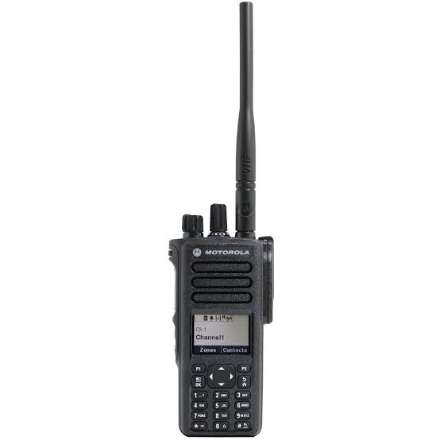
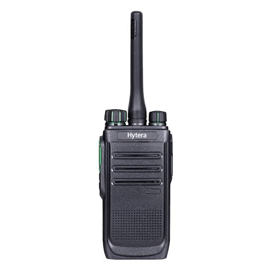
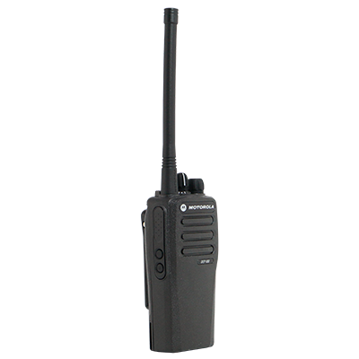

# Equipos conocidos

Catálogo de referencia rápida de los equipos de radio identificados hasta ahora,
por familia/modelo y rango de `radio_id`. El detalle completo de cada hallazgo
(logs, timestamps, método de investigación) vive en
`../sdr-decoder/INVESTIGACION_LRRP.md` — acá solo el resumen por equipo, para
no tener que releer todo el historial cada vez que hace falta ubicar qué es
cada `radio_id`.

Documento vivo: actualizar cada vez que se identifique un equipo nuevo, se
confirme un modelo/marca que faltaba, o se aprenda una característica nueva de
uno ya conocido (ver `GET /api/equipos` para el estado en vivo de quién está
online y cuál fue el último evento de cada uno).

**Fotos**: se van a ir agregando en `docs/images/` a medida que se consigan.
Usar siempre `` para que todas queden del mismo tamaño en
el documento, no el tamaño real del archivo.

---

## Motorola DGP8550 — handies, radio_id 1001 a 1006

- **Modelo**: Motorola DGP8550 — confirmado por el usuario en el codeplug de
  uno de estos equipos (ver `../sdr-decoder/INVESTIGACION_LRRP.md`).
- **radio_id vistos transmitiendo hasta ahora**: `1001`, `1002`, `1003`,
  `1004`, `1005`, `1006` — con esto ya se completó todo el rango 1001-1006
  asignado a este modelo.
  - `1001` — alias conocido: **Matías**.
  - `1002` — alias conocido: **BVM1002**.
  - `1003`, `1004`, `1005`, `1006` — sin alias humano asignado todavía
    (aparecen en el panel mostrando el propio `radio_id` como alias,
    comportamiento default cuando no hay uno cargado — ver `API.md`).
  - `1005` transmitió con evento `emergencia` (no `voz` normal) en su primera
    detección (2026-08-17) — pendiente confirmar si es un botón de pánico del
    equipo o una prueba puntual.

### Características / hallazgos
- **Codeplug**: el canal de voz normal usa Timeslot 1. Existe un canal
  separado, **"GPS-R2"**, en Timeslot 2, misma frecuencia y mismo Color Code
  (1) — confirmado por el usuario directamente en el codeplug de uno de estos
  HT, no inferido.
- **GPS soportado pero nunca capturado**: estos equipos tienen el canal
  GPS-R2 configurado (o sea, GPS habilitado a nivel codeplug), pero **jamás
  se capturó un token LRRP/LOCN real** de ninguno — ni activando el modo de
  rastreo, ni en el instante exacto de obtener un fix GPS confirmado
  (sesiones 13-14). Consistente con la hipótesis de que el LRRP necesita una
  solicitud activa del lado de la red (Location Server / NAI-D), bloqueada acá
  por la autenticación TLS-PSK de la repetidora (Sesión 5) — no parece ser una
  limitación del hardware/modelo en sí.
- Transmiten voz como `Group Call` genérico (`FID=0x00`) — a diferencia de
  Base Guardia (ver más abajo), que usa una variante distinta de fabricante.

---

## Hytera BD506 — handies, radio_id 1100 a 1109

- **Modelo**: Hytera BD506 — confirmado por el usuario.
- **radio_id vistos transmitiendo hasta ahora**: `1102` (dentro del rango
  1100-1109 asignado a esta familia; el resto del rango todavía no se vio
  transmitir).

### Características / hallazgos
- Única prueba puntual conocida hasta ahora (PTT de ~5s, sesión temprana de
  investigación): **no arrojó contenido de voz reconocible**, solo unos pocos
  bursts marginales de ruido (Color Code=00). **Esto no es evidencia de que
  el Hytera no transmita nada decodificable** — la muestra fue de un solo PTT
  corto, insuficiente para concluir nada; queda pendiente de reintentar con
  una prueba más larga/deliberada.
- Sin datos todavía sobre si estos equipos soportan GPS o no.

---

## Base genérica con GPS — radio_id 1012 (marca sin confirmar)

- **Modelo/marca**: no recordada por el usuario todavía — **pendiente de
  confirmar**, no inventar un fabricante.
- **radio_id**: `1012`.

### Características / hallazgos
- El usuario confirma que este equipo **tiene GPS habilitado** (a diferencia
  del DEP450, ver abajo).
- Transmitió voz normal (`Group Call`), sin ningún token LRRP/LOCN — **mismo
  patrón exacto que los Motorola DGP8550**, pese a ser de un fabricante
  distinto. Este es un hallazgo importante: refuerza la hipótesis de que la
  ausencia de LRRP es un bloqueo del lado de la red (TLS-PSK), no algo
  específico de una marca o modelo — ver `../sdr-decoder/INVESTIGACION_LRRP.md`, sección
  "Hito — primera captura real sin coordinación".
- Primera transmisión capturada sin coordinación en tiempo real (nadie
  estaba avisado ni mirando la consola en el momento) — primera confirmación
  real de que el bridge containerizado captura tráfico real de forma
  desatendida.

---

## Baofeng UV-32 — handy personal, radio_id 1

- **Modelo**: Baofeng UV-32 — confirmado por el usuario. Es un equipo
  personal de un efectivo (no parte del parque de equipos del cuartel), DMR y
  **con GPS**.
- **radio_id**: `1`.

### Características / hallazgos
- Primera detección: 2026-08-17, 10 líneas seguidas en un mismo bloque con
  `TGT=1 SRC=1` (el equipo aparece como su propio destinatario) — en su
  momento se marcó como posible artefacto de decodificación por lo atípico
  del patrón, pero el usuario confirmó que el equipo es real. Queda pendiente
  de entender si `TGT=1` es simplemente el grupo/canal en el que está
  programado (coincide con su propio `radio_id` por casualidad) o algo propio
  de cómo este modelo arma el `Group Call`.
- 🎯 **GPS: mecanismo confirmado, y NO es LRRP.** El 2026-08-17 el usuario usó
  la función "Send → Contacts" del handy hacia el contacto `radio_id 1007`.
  El UV-32 manda la posición como **texto plano UTF-16LE dentro de un
  paquete UDP** (puerto 4007↔4007) — no como LRRP/LOCN, el protocolo que se
  venía investigando desde el principio con los demás equipos. Se pudo
  capturar el contenido (`Lat: 32°20'26. / Long: 65°1'28.9" / Speed: 0KM/H`,
  ≈ -32.3406, -65.0247) porque `1007` no tenía el puerto UDP escuchando y
  devolvió un error ICMP "Port Unreachable" que incluyó de vuelta el paquete
  original — detalle completo, timestamps y hexdump en
  `../sdr-decoder/INVESTIGACION_LRRP.md`, sección "🎯 HITO — Primera
  coordenada GPS real capturada". **Es un hallazgo forense, no
  automatizado**: el bridge no reconoce este patrón todavía, así que la
  coordenada no llegó al mapa ni a la base de datos.
- **Relación con `radio_id 529385`** (ver "Sin identificar todavía" más
  abajo): ambos son sospechados de ser equipos Baofeng usados por un
  "efectivo personal", pero **no está confirmado si son el mismo handy
  físico o dos unidades distintas** — pendiente de una prueba que
  identifique a `529385` sin error de CRC para poder compararlo.

### Nota — `radio_id 1007` no es un equipo del sistema
`1007` apareció únicamente como **destinatario** de los paquetes de datos
descriptos arriba — nunca transmitió nada por sí mismo (ni voz, ni ARS, ni
presencia), y no figura en `GET /api/equipos`. Es el contacto configurado en
la agenda del UV-32 al que se le mandó el GPS, no un radio activo del
cuartel. No agregarlo como equipo catalogado a menos que en algún momento
transmita algo por su cuenta.

---

## Motorola DEP450 — pendiente de identificar (sin radio_id conocido todavía)

- **Modelo**: Motorola DEP450.
- **radio_id**: ninguno confirmado todavía — **no se hizo ninguna
  transmisión de prueba con este modelo hasta ahora**, así que no hay forma
  de saber qué `radio_id` usa.

### Características / hallazgos
- **DMR, sin GPS** — a diferencia de los DGP8550 y de la base 1012, este
  modelo no tiene soporte de posición (dato del usuario, no verificado por
  captura todavía porque no hay transmisión de prueba).
- **Pendiente**: coordinar un PTT de prueba con un DEP450 para identificar su
  `radio_id` y confirmar el patrón de detección (voz, tipo de `Group Call`,
  etc.) — sin GPS, no se espera encontrar LRRP, pero sirve para tener el
  equipo catalogado como los demás.

---

## Base Guardia — radio_id 1000

- **Modelo/marca**: equipo fijo del cuartel (no es un handy) — marca/modelo
  no documentados todavía.
- **radio_id**: `1000`.
- **Alias conocido**: Base Guardia.

### Características / hallazgos
- **Emite un registro ARS** (`MNIS ARS`, `mnis_type` `0x33`) de forma
  periódica y espontánea — único tráfico de datos visto en el sistema en las
  17+ sesiones de investigación hasta ahora. Intervalo medido con precisión:
  **~68 segundos** (confirmado con tres repeticiones consecutivas exactas en
  la Sesión 14; mediciones anteriores con menos precisión dieron ~58s y
  ~68s).
- **Transmite voz también**, pero como `Group TXI Call` (`FID=0x10`, un flag
  de fabricante de "Transmit Interrupt") — **no** el `Group Call` genérico
  (`FID=0x00`) que usan los DGP8550. La regex de detección de voz del bridge
  tuvo que ampliarse específicamente para reconocer esta variante (ver
  sesión de implementación de la bitácora de audio) porque no matcheaba con
  la original.
- Nunca se vio un token LRRP/LOCN de este equipo.
- Visible tanto en el downlink de la repetidora como directamente en el
  uplink (confirmado en la Sesión 13) — transmite como una unidad más del
  sistema DMR (igual que un handy), no como una conexión directa al backend
  de la repetidora.

---

## Sin identificar todavía

- **`radio_id 529385`**: una única detección (voz, `Group Call`), con
  `(CRC ERR)` marcado por `dsd-fme` — posiblemente un HT nuevo (¿el
  "efectivo personal" con equipo propio?), o un artefacto de colisión de
  canal con una transmisión simultánea de Matías (1001). Los bloques
  inmediatamente antes y después no muestran ninguna otra actividad. **No
  confirmado si es un equipo real** — pendiente de una nueva transmisión
  (idealmente sin nadie más hablando al mismo tiempo) para confirmar con una
  decodificación limpia, sin error de CRC. Posible relación con el Baofeng
  UV-32 (`radio_id 1`, ver más arriba) — no confirmado si es el mismo equipo.

---

## Próximos pasos generales

- Evaluar si vale la pena implementar en el bridge una detección automática
  del patrón de GPS en texto plano descubierto en el Baofeng UV-32 (paquete
  UDP + texto con `Lat:`/`Long:`/`Speed:`) — es un camino de GPS funcional ya
  confirmado, independiente del bloqueo de TLS-PSK que afecta a LRRP en el
  resto de los equipos (ver `../sdr-decoder/INVESTIGACION_LRRP.md`, sección
  "🎯 HITO — Primera coordenada GPS real capturada").
